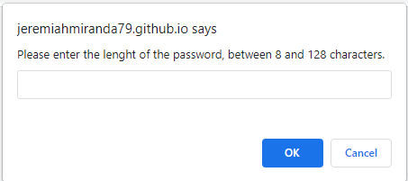
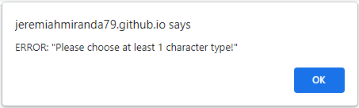
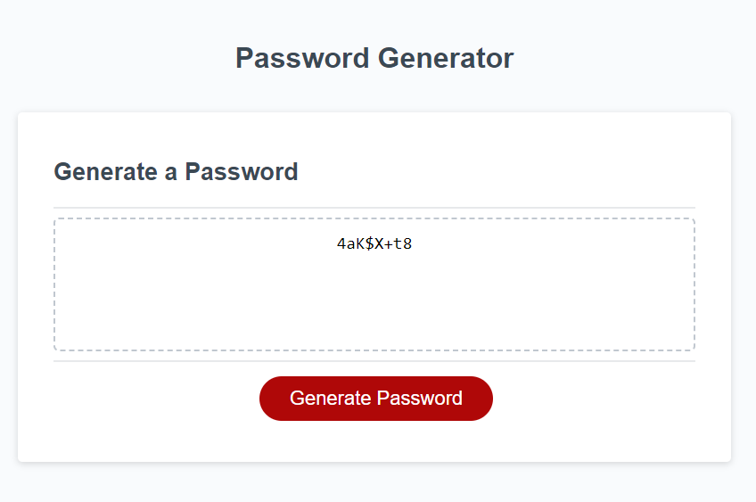

# Password Generator

## Description
- The password generator takes input from the user to decide the lenght of the password along with what character types should be allowed.
- The application validates the user input.
- The password generator validates that atleast one of each of the user selected character types is used in the password.
- When the generate password button is clicked it will then display the newly generated password.

## Simple Installation

Simpily follow this  link to view view the Password Generator appplication. https://jeremiahmiranda79.github.io/Password-Generator/

## Usage

Use the prompts to give the application your desired password length, and types of character you want in your password.

The application is smart, and validated that the user selected the prompts correctly.

The generated password will contain atleast one of each selected character type.

## License

N/A

## Development

This project was created using Visual Code, HTML, CSS, GitHub, and JavaScript.

## How to Contribute

Currently this project is closed for contribution.

# Thank you
I appreciate your interest in my projects!